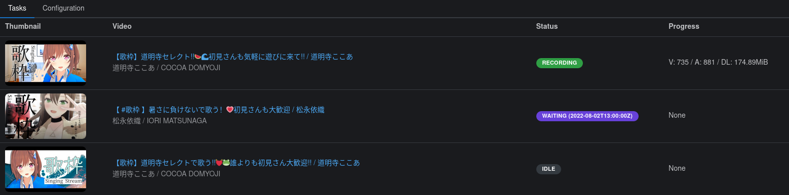

# hoshinova

> Monitor YouTube channels and automatically run
> [ytarchive](https://github.com/Kethsar/ytarchive) when the channel goes live.

**⚠️ Unstable Software**: This program is under heavy development. It works, but
will still undergo a lot of breaking changes. Upgrade with caution.

[](https://discord.gg/y53h4pHB3n)
[](https://github.com/HoloArchivists/hoshinova/releases)



## Features

- Monitor and automatically record live streams from multiple YouTube channels
- View and manage recording status from a web interface
- Receive notifications whenever a stream goes live, or has finished being
  recorded

## Install

You can get hoshinova using either one of the following methods.

### Get the latest release

You can download the latest binaries
[from the releases page](https://github.com/HoloArchivists/hoshinova/releases).

[](https://github.com/HoloArchivists/hoshinova/releases/latest/download/hoshinova-x86_64-pc-windows-gnu.exe)
[](https://github.com/HoloArchivists/hoshinova/releases/latest/download/hoshinova-x86_64-unknown-linux-musl)
[](https://github.com/HoloArchivists/hoshinova/releases/latest/download/hoshinova-aarch64-unknown-linux-musl)

Make sure you have [ytarchive](https://github.com/Kethsar/ytarchive) and
[ffmpeg](https://ffmpeg.org/) installed and executable in your PATH
([guide](https://github.com/HoloArchivists/hollow_memories)).

### Run from source

```bash
# Clone the repository
git clone https://github.com/HoloArchivists/hoshinova

# Generate TypeScript bindings
cd hoshinova
cargo test

# Build the web UI
cd web
yarn install && yarn build

# Build and run hoshinova
cd ..
cargo run
```

### Get the docker image

```
docker pull ghcr.io/holoarchivists/hoshinova:main
```

Run with Docker:

```
docker run -d \
  -p 1104:1104 \
  -v $(pwd)/config.toml:/app/config.toml:ro \
  -v $(pwd)/videos:/app/videos \
  -v $(pwd)/temp:/app/temp \
  ghcr.io/holoarchivists/hoshinova:main
```

** Note **: When running in Docker, the service runs as UID 1000, so bind-mount permissions need to be set correctly: `chown -R 1000:1000 ./videos ./temp` (adjust paths to whatever locations your mounting to the Docker container volumes).

Or with `docker-compose`:

```yaml
version: "3"
services:
  hoshinova:
    image: ghcr.io/holoarchivists/hoshinova:main
    restart: unless-stopped
    ports:
      - 127.0.0.1:1104:1104
    volumes:
      - ./config.toml:/app/config.toml
      - ./temp/:/app/temp
      - ./videos:/app/videos
```

** Note **: When using `docker-compose`, restarting the service will not update it. To update, use `docker-compose pull` and then `docker-compose up -d`.

## Configure

Copy the `config.example.toml` file to `config.toml` and edit the file as
needed.

### ytarchive configuration

```toml
[ytarchive]
executable_path = "ytarchive"
working_directory = "temp"
args = [
  "--vp9", "--thumbnail", "--add-metadata", "--threads", "4",
  "--retry-stream", "30",
  "--output", "%(upload_date)s %(title)s [%(channel)s] (%(id)s)"
]
quality = "best"
delay_start = "1s"
```

The default configuration should work for most cases. If you don't have
`ytarchive` in your PATH, you can specify absolute path in the `executable_path`
section (for example, `/home/user/bin/ytarchive`).

You can also set a different `working_directory`. This is the place where
ytarchive will download videos to while it's live. After it's done, the files
will be moved to the `output_directory` configured in each channel (see below).

By default, the `--wait` flag is added automatically. You can add more flags
too, if you need to use cookies, change the number of threads, etc. Just note
that each argument needs to be a separate item in the list (for example,
`["--threads", "4"]` instead of `["--threads 4"]`).

The `delay_start` parameter can also be adjusted if you are starting a lot of
downloads simultaneously. The parameter add some delay between launching
ytarchive instances.

### scrapers and notifiers

```toml
[scraper.rss]
poll_interval = "30s"
ignore_older_than = "24h"
```

Right now there's only an RSS scraper. More may be added in the future. You can
change the `poll_interval`, which specifies how long to wait between checking
the RSS feeds of each channel.

You can use the `ignore_older_than` parameter to skip checking videos that are
older than the specified duration. This is useful if your filters match a lot of
videos and don't want to hit rate limits during startup.

```toml
[notifier.discord]
webhook_url = "https://discordapp.com/api/webhooks/123456789012345678/abcdefghijklmnopqrstuvwxyz"
notify_on = ["waiting", "recording", "done", "failed"]
```

This part is optional. You can remove this section if you don't want any
notifications.

Right now you can only send notifications to Discord. You can get the
`webhook_url` by following
[these instructions](https://support.discord.com/hc/en-us/articles/228383668-Intro-to-Webhooks).
The `notify_on` setting lets you specify which events you want to be notified
about. Right now there are only 4 events:

| Event       | Description                                                |
| ----------- | ---------------------------------------------------------- |
| `waiting`   | The stream waiting room is available but it's not live yet |
| `recording` | The stream has just started and is being recorded          |
| `done`      | The stream is over                                         |
| `failed`    | Something went wrong while recording the stream            |

### webserver

A webserver is available for you to view and monitor your tasks. If you don't
want this, you can remove this section.

```toml
[webserver]
bind_address = "0.0.0.0:1104"
```

`bind_address` is the address the webserver will listen to. Setting the address
to `0.0.0.0:1104` will let anyone access the web interface. If you only want to
access it from the computer you're running `hoshinova` from, set the address to
`127.0.0.1:1104`.

Feel free to adjust the port `:1104` to any number up to `65535`.

Note that if you're running in Docker, you most likely want to set the bind
address to `0.0.0.0`.

### channel configuration

```toml
[[channel]]
id = "UCP0BspO_AMEe3aQqqpo89Dg"
name = "Moona Hoshinova"
filters = ["(?i)MoonUtau|Karaoke|Archive"]
outpath = "./videos/moona"
```

This part can be copy-pasted multiple times to monitor and record multiple
channels. The `id` field is the channel ID. It's the ending part of e.g.
`https://www.youtube.com/channel/UCP0BspO_AMEe3aQqqpo89Dg`.

> If you have a `https://www.youtube.com/c/SomeName` URL you can use this
> bookmarklet to convert it to a `/channel/` URL:
>
> ```
> javascript:window.location=ytInitialData.metadata.channelMetadataRenderer.channelUrl
> ```

The `name` can be anything, it's just to help you identify the channel in the
config file.

`filters` is a list of regular expressions to match on video titles. You can
[check the syntax here](https://docs.rs/regex/latest/regex/#syntax).

`outpath` is the output folder where you want the resulting videos to be moved
to.

## Creating release builds

Use the helper script `build.sh` to generate optimized release binaries for
multiple targets. It uses `cross-rs`, which uses Docker, to automatically set up
the build environment for cross-compilation.

If you run into any linking issues, run `cargo clean` and try again.

## Debug logging

Run with the environment variable `RUST_LOG=debug` or `RUST_LOG=trace` to enable
verbose logging.

```
RUST_LOG=debug cargo run
```

Note that you will likely also get debug logs from libraries that hoshinova
depends on. To only get debug logs for hoshinova, use
`RUST_LOG=hoshinova=debug`. For more information, see
[env_logger's documentation](https://docs.rs/env_logger/0.9.0/env_logger/).

## Support

[](https://discord.gg/y53h4pHB3n)

This is very early in development. New features will be added, and existing
features may be changed or removed without notice. We do not make any guarantees
on the software's stability.

That being said, we're open to accepting input, bug reports, and contributions.
If you run into any issues, feel free to
[hop on our Discord](https://discord.gg/y53h4pHB3n), or
[file an issue](https://github.com/HoloArchivists/hoshinova/issues/new/choose).
